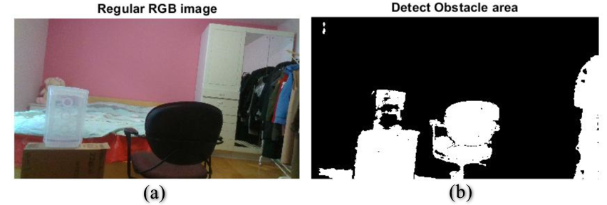

# Algorithm and Implementation

The implementation of the project has been done in MATLAB. Rapid-exploring Random Tree Algorithm has been implemented for trajectory plan and object detection algorithm has been built with depth information extracted from RealSense Camera. The overall implementation and instructions have been committed to GitHub at **[https://github.com/luckymeng7/EECE597](https://github.com/luckymeng7/EECE597)**.


```{r libraries, include=FALSE}
library(knitr)
library(dplyr)
library(lattice)

knitr::opts_chunk$set(echo = TRUE)
```

## Rapid-exploring Random Tree Algorithm for Pathway Planning 

Rapid-exploring Random Tree (RRT) algorithm was introduced by Steven M. LaVell and James J. Kuffner Jr [@rrt].  To efficiently search nonconvex and high-dimensional spaces, the algorithm constructs a space-filling tree from samples drawn randomly in the search space and inherently grows towards large unsearched areas. 

The output of the RRT algorithm is a tree(T) that contains all of the randomly sampled nodes(q) with connection to their inherit points. With object-oriented programming, each of the sampled node has been assigned as an instantiation of *Node* class with properties including index, parent index, position and path to node. The output tree is an instantiation of *RRT* class which is defined to contain all generated nodes, with properties including total number of the nodes, initial node, positions of all existing node and a list of all existing nodes. A new node will be sampled in each iteration and the RRT tree will be updated to include the new node if the path to this new node has avoided the obstacle. To generate a new node(qnew), a random point(qrand) will be firstly generated within the map range. Then it will be connected to the nearest node(qnear) on the tree. On the connection line, a point with max-step distance (step size) to the nearest point will be selected as the new node if it is confirmed as clear with obstacle free function. Figure \@ref(fig:figure1) shows the generation of one new node to the tree. The algorithm will use the initial point as the first *Node* of the tree, and update the RRT tree until the distance between the latest generated node and destination point is less than the step size.

```{r figure1, echo=F, eval=T, fig.width=9, fig.asp=1.0, fig.cap='(ref:figure1)', out.width="60%", fig.align='center'}
knitr::include_graphics('figures/1.png')
```

(ref:figure1) New Node Generation[@choset2015robotic]

For a general configuration space, the algorithm in pseudocode is as follow [@rrtCompare]:

```
Algorithm T=(V,E) ← RRT*(qini)
T ← InitializeTree();
T ← InsertNode(𝜱, qini, T);

    for i = 1 to K do
        qrand ← RAND_CONF()
        qnearest ← NEAREST_VERTEX(qrand, T)
        qnew ← STEER (qnear, qrand, Δq)
	      if Obstaclefree(qnew) then
        	qnear ← Near(∆D, qnew, T);
		qmin ← Chooseparent(qnear, qnew, qnearest);
		T ← InsertNode(qmin, qnew, T);
		T ← Rewire(T,qmin, qnew, qnear);
      
    return T

```

* "←" denotes assignment. For instance, "largest ← item" means that the value of largest changes to the value of item.
*	"return" terminates the algorithm and outputs the following value.


The inputs for the algorithm are initial position, destination position, max step size, obstacle size and position and the overall map size. The output for the function is a planned path and the overall tree. 

Real-time obstacle detection has also been implemented. As the robot moving forward, the function would recalculate the tree when it detects a new obstacle shows up. The current position would be taken as the new start point and the destination position would still be the same. Figure \@ref(fig:figure2) shows path updated twice after initial path planned. This figure is generated by running script **[pathPlan_main.m](https://github.com/luckymeng7/EECE597/blob/master/PathPlanRRT/pathPlan_main.m)** in folder "PathPlanRRT" on GitHub. 


```{r figure2, echo=F, eval=T, fig.width=9, fig.asp=1.0, fig.cap='(ref:figure2)', out.width="90%", fig.align='center'}

```

(ref:figure2) Path updated when new obstacle detected


At the beginning, a original RRT path was calculated  from the start point to destination point. Figure \@ref(fig:figure2) (a) shows the original path with one obstacle detected in the filed. Then in figure \@ref(fig:figure2) (b), a new obstacle was added to the canvas after the robot moved along the original path for 10 steps. The current position at the time of (b) for the robot was the 10th Node on the original path. A new RRT tree was calculated to update the path which avoided the new obstacle. Similarly, in figure \@ref(fig:figure2) (c), a new obstacle was added to the canvas after the robot moved along the updated path for another 30 steps. Another new RRT was calculated to avoid the new obstacle. Then the robot would move on with the updated path to the destination point. Figure \@ref(fig:figure2) (d) shows the actual path of the robot moving from start to end point when new obstacles showed up along the way.

The density of the tree indicates the total generated Nodes on the tree to get a viable path. Mode random points generated to get the path lead to more nodes on the tree. Small step size or long distance between the start and end point would increase the number of calculating iterations for the RRT. Other variants such as the position of obstacles and the distance between obstacles would also influence the total number of nodes. 

## Image Processing for Obstacle Detection

With the video stream captured with Intel RealSense camera, the depth information could be used for object detection. The output file type of the RealSense camera is bag file. Bag is a file format in ROS for storing ROS message data [@bag]. An example of the bag file that used in this project is uploaded to GitHub at **[https://github.com/luckymeng7/EECE597/tree/master/Videos](https://github.com/luckymeng7/EECE597/tree/master/Videos)**. With MATLAB’s ROS toolbox, the bag video was imported and processed as depth frames and RGB frames. A function has been implemented to identify the obstacle based on the depth information. On each of the frames, an obstacle mask will be created in which all the pixels that has depth value within the sensitive detection range will be set to 100 and the rest of pixels will be set to 0. A comparison between regular RGB image and detected obstacle area are shown in figure \@ref(fig:figure3).

```{r figure3, echo=F, eval=T, fig.width=9, fig.asp=1.0, fig.cap='(ref:figure3)', out.width="80%", fig.align='center'}

```

(ref:figure3) Obstacle detected in depth field

In order to project the obstacles properly onto the map where the trajectory is to be planned, top views for each frame are created by switching the depth value with the height index. By looping through the columns number of the depth image, using the smallest depth value of each column as the row number and assign row number of the related point to the value of that pixel for the top view. The reason of using the top view for the obstacles is that we are assuming the robots are moving horizontally on the map in figure \@ref(fig:figure2). Therefore, we are assuming the obstacles on map in figure \@ref(fig:figure2) align at the same horizontal level as the robot. If the camera sits along x axis, facing y positive, the x and y axes on the map are the width and distance value in the camera. To define the obstacle, a distance threshold is used to set the limitation of the depth size. For example, in the following demos, only objects within two meters to the camera would be captured as object and saved in top view as figure \@ref(fig:figure4). 

```{r figure4, echo=F, eval=T, fig.width=9, fig.asp=1.0, fig.cap='(ref:figure4)', out.width="60%", fig.align='center'}

```

(ref:figure4) Top view based on depth information

Figure \@ref(fig:figure3) and \@ref(fig:figure4) are generated by running script **[videoProcess_main.m](https://github.com/luckymeng7/EECE597/blob/master/ObjectDetection/videoProcess_main.m)** in folder "ObjectDetection" on GitHub. Output videos are created by combining frames of top views generated with depth frames. 

## Measurement af the Object Size with RealSense Camera

Based on the datasheet of the RealSense camera [@realSenseD400], the horizontal field of view (FOV) for depth image is 74 degree and vertical field of view for depth image is 62 degree. 

```{r figure12, echo=F, eval=T, fig.width=9, fig.asp=1.0, fig.cap='(ref:figure12)', out.width="80%", fig.align='center'}

```

(ref:figure12) Depth Field of View from camera manual [@realSenseD400]


```{r figure5, echo=F, eval=T, fig.width=9, fig.asp=1.0, fig.cap='(ref:figure5)', out.width="90%", fig.align='center'}

```

(ref:figure5) Definition of field of view 

Based on the definition of FOV in figure \@ref(fig:figure5), the actual width and height based on the pixel value could be calculated as:


$$ Actual \space width = \frac{width \space pixel}{resolution \space on \space width} \cdot depth \cdot \tan(\frac{74}{2}) \cdot 2 $$

$$ Actual \space height = \frac{height \space pixel}{resolution \space on \space width} \cdot depth \cdot \tan(\frac{74}{2}) \cdot 2 $$

In order to use actual size as base point to do the calibration, I transferred the above equations into:


$$ \tan(\frac{74}{2}) \cdot 2 = \frac{rp \cdot L1}{l1 \cdot D1} $$

Where, 

- rp is the resolution on width or height direction, 
- L1 is the actual width or height, 
- l1 is the pixel number on width or height,
- D1 is the depth distance.

After another transformation for the above equation, we will get:
$$\frac{L1}{l1 \cdot D1} = \frac{L2}{l2 \cdot D2} = C$$
With the above function, we could calculate the constant __C__ with the actual length L1 measured by ruler, the length in pixel l1 on the RGB frame and the depth value D1 from the depth frame of the first object. Then, actual length of L2 could be calculated for the second object based on constant C, the length in pixel l2 on the RGB frame and the depth value D2 from the depth frame. To increase the accuracy of the calculation for L2, multiple L1 objects could be measured. Then L2 are calculated with the average of C.

The tables \@ref(tab:mytable1) and \@ref(tab:mytable2) are the measurements of the first group of objects to calibrate the measurement, with a resolution of 1280x720 for depth image and RGB image. Regular-shape objects are chosen for the calibration to increase the accuracy. The measurement of actual height and width are done with a ruler on the object and the measurement of height and width in pixel is measured on the RGB image directly. The depth value of the center point of each object has been used as the depth value for the overall object. The unit for actual length are millimetre.


```{r mytable1, echo=F, eval=T}
df <- tribble(
  ~"Item", ~"Depth(mm)", ~"Height(Actual)", ~"Height(Pixel)", ~Ch,
  #--/--/--/--/--/--/--/----
  1, 415,	75,	171, 0.00106,
  2, 297,	90,	270, 0.00112,	
  3, 683, 252, 336, 0.00109
)

df <- as.data.frame(df)

 knitr::kable(df,
              digits = c(0, 0, 0, 0, 5),
              booktabs = TRUE, escape=FALSE,
              caption = 'Measurements for calibration (Height)'
 )

```

```{r mytable2, echo=F, eval=T}
df <- tribble(
  ~"Item", ~"Depth(mm)", ~"Width(Actual)", ~"Width(Pixel)", ~Cw,
  #--/--/--/--/--/--/--/----
  1, 415,	225,	489,	0.00111,
  2, 297,	142,	435,	0.00109,
  3, 683, 173, 227.5, 0.00111
)

df <- as.data.frame(df)

 knitr::kable(df,
              digits = c(0, 0, 0, 1, 5),
              booktabs = TRUE, escape=FALSE,
              caption = 'Measurements for calibration (Width)'
 )

```

Figure \@ref(fig:figure6) are the images for the above objects (1,2,3 from left to right):

```{r figure6, echo=F, eval=T, fig.width=9, fig.asp=1.0, fig.cap='(ref:figure6)', out.width="90%", fig.align='center'}

```

(ref:figure6) Images for calibration

To evaluate the accuracy of the calculate with equation $$\frac{L1}{l1 \cdot D1} = \frac{L2}{l2 \cdot D2} = C$$, the three objects in figure \@ref(fig:figure7) are measured.

```{r figure7, echo=F, eval=T, fig.width=9, fig.asp=1.0, fig.cap='(ref:figure7)', out.width="90%", fig.align='center'}

```

(ref:figure7) Images for measurement test 

The results of the calculation and measurement are as tables \@ref(tab:mytable3),  \@ref(tab:mytable4) and \@ref(tab:mytable5), where $$L2 = C \cdot l2 \cdot D2$$


```{r mytable3, echo=F, eval=T}
df <- tribble(
  ~"Item", ~"Depth(mm)", ~"Height(Pixel)", ~"Avg. Ch", ~"Width(Pixel)", ~"Avg. Cw",
  #--/--/--/--/--/----
  4, 2890, 670, 0.00109, 225, 0.0011,
  5, 325, 201, 0.00109, 152, 0.0011,
  6, 557, 518, 0.00109, 117, 0.0011
)

df <- as.data.frame(df)

 knitr::kable(df,
              digits = c(0, 0, 0, 5, 0, 4),
              booktabs = TRUE, escape=FALSE,
              caption = 'Information from image'
              )
```

```{r mytable4, echo=F, eval=T}

df <- tribble(
  ~"Item", ~"Calculated Height", ~"Actual Height", ~"Error Rate",
  #--/--/--/--/--/--/----
  4, 2110,	2100,	0.48,
  5, 71.2,	80,	11,
  6, 314.5,	325,	3.2
)


df <- as.data.frame(df)

 knitr::kable(df, 
              digits = c(0, 1, 0, 2),
              booktabs = TRUE, escape=FALSE,
              caption = 'Measurement Result and Error Rate on Height(mm, percentage)'
              )
```

```{r mytable5, echo=F, eval=T}

df <- tribble(
  ~"Item", ~"Calculated Width", ~"Actual Width", ~"Error Rate",
  #--/--/--/--/--/--/----
  4,	898, 920,	2.4,
  5,	54.3,	60,	9.5,
  6,  71.7,	82, 12.6
)


df <- as.data.frame(df)

 knitr::kable(df, 
              digits = c(0, 1, 0, 1),
              booktabs = TRUE, escape=FALSE,
              caption = 'Measurement Result and Error Rate on Width(mm, percentage)'
              )
```

According to the datasheet [@realSenseD400] of RealSense Camera, there is a mechanical tolerance of +/-5% for the camera. Therefore, the error measured is within the tolerance. As we could see, the error is relatively smaller if the shape of the object is rectangle and the object is facing the camera perpendicularly. Physical measurement on object with anomalous shape will introduce more error compare to rectangles. Also, to simplify the calculation, depth value of the center on the object was used for the calculation. However, this is not always viable. For example, the depth value at the center of the water bottle is different from the depth value for the edge. This deviation on depth value will introduce error. Objects not facing the camera perpendicularly will also introduce errors with the misalignment for the width and height.

To increase the accuracy for the calculation, two approaches could be done in the future. Firstly, instead of using the depth value at the center of the object to represent the distance to the whole object, we could calculate average depth of the object and use it for calculation. Another method is to calculate the width and height with the coordination in 3D which combines both depth and RGB information.   
 
## Combination of Obstacle Detection and Trajectory Plan

In order to integrate the detected obstacle onto the trajectory plan, the top view of detected obstacle will be projected on the map after re-sizing and rotation. Assuming initially the camera is facing the direction from start point to destination point and the current map size is on a dimension of 200x200 pixel, the top view of the obstacle will be re-sized to meet the mapping scale and rotated based on camera orientation. An obstacle mask based on the top view frames will be shifted onto the map with the bottom center point of the mask coincide with the camera’s current position. When new obstacles detected as the camera moving forward, the trajectory plan function will re-calculate the path with generating a new RRT tree. Figure \@ref(fig:figure8) shows the obstacle mask generated with the top view frame from section 2.2 and an RRT path is calculated with obstacle mask projected on map after rotation and shifting. The scale for the map is 1:31.25, which means that 31.25 pixels on the map represent 1 meter. 

```{r figure8, echo=F, eval=T, fig.width=9, fig.asp=1.0, fig.cap='(ref:figure8)', out.width="90%", fig.align='center'}

```

(ref:figure8) Detect Obstacle on Map

Once the camera starts to move based on the generated path, the object detection and path recalculation will continue. After the start point, the direction of the camera will be changed to the vector difference between current position and previous position. The newly generated mask will be re-sized, shifted and rotated to the new position and direction. If the obstacles condition has been changed since last projection, a new RRT tree will be generated and the camera will move along the new path. 

In order to increase the safety and avoid the drone being trapped in the anomaly shaped obstacle, a minimum volume ellipsoid has been generated to cover all of the obstacle points as shown in f(c) of igure \@ref(fig:figure9). The algorithm to find the ellipsoid is discussed in the textbook “Convex Optimization” [[@convexOpt]and the function usage in MATLAB is described in [[@miniEllipsoid] .
This method is efficient for one single obstacle in the field. When multiple obstacles exist, this algorithm would cover all the obstacles in one ellipsoid, which would increase error rate and increase the difficulty of finding a viable path. 
```{r figure9, echo=F, eval=T, fig.width=9, fig.asp=1.0, fig.cap='(ref:figure9)', out.width="90%", fig.align='center'}
knitr::include_graphics('figures/9.png')
```
(ref:figure9) Detected obstacle with minimum volume ellipsoid covered

Because of the long RRT calculation time and video processing time, the object will be checked every 5s when the robot’s moving speed is 0.1m/s

## Update the path as obstacle moving
Two scenarios have been demonstrated to show that the implementation could recalculate the path when the camera detects the object change. Multiple obstacles would show up in the global map as the robot moving along the path. Also, the original obstacles would change the position from time to time. The program would recalculate the RRT tree when changes happen to the environment. 

Ideally, the path would only be recalculated when new obstacles are added in the map as shown in figure \@ref(fig:figure2). However, in reality, with the vibration and noise, the information of the detected obstacles will change all the time. If the function is set to recalculate the RRT whenever detecting a change in obstacles, it would keep recalculating all the time. Therefore, an update rate as has been defined to set the time between the updates of the camera streaming. In the example demo, the update rate has been set to 20 iterations. The updated camera video will be checked when the robot moves along the previously defined path for 20 steps. With the scale as 1:31.25 and step size as 2, the camera will be checked everytime when the robot moves for 1.28 meter. This update rate is defined in **[integrate_main.m](https://github.com/luckymeng7/EECE597/blob/master/Integrate/integrate_main.m)** in folder "Integrate" on GitHub and could be modified as needed.

Figure \@ref(fig:figure10) shows the path updated when new objects detected. And figure \@ref(fig:figure11) shows the path updated when a single objet changes position as the robot is moving. 


```{r figure10, echo=F, eval=T, fig.width=9, fig.asp=1.0, fig.cap='(ref:figure10)', out.width="90%", fig.align='center'}
knitr::include_graphics('figures/10.png')
```

(ref:figure10) Path updated when new objects detected


```{r figure11, echo=F, eval=T, fig.width=9, fig.asp=1.0, fig.cap='(ref:figure11)', out.width="90%", fig.align='center'}

```

(ref:figure11) Path updated when object moved

The update for obstacles are done by streaming the video separately at different time point. Then these videos are fed into the path plan funciton to recalculate the path. This process indicates the concept of the capability on updating the obstacles in real time. An actual real time object detection during path planning could be implemented with RealSense SDK in the future. 
