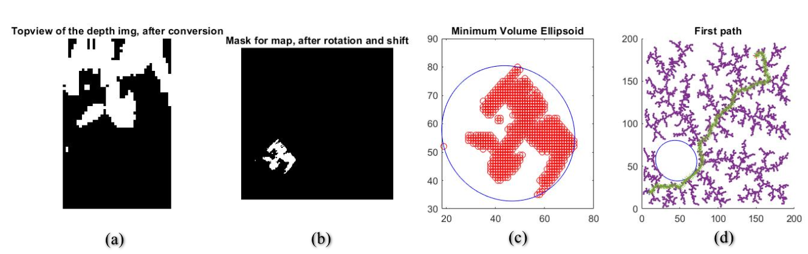
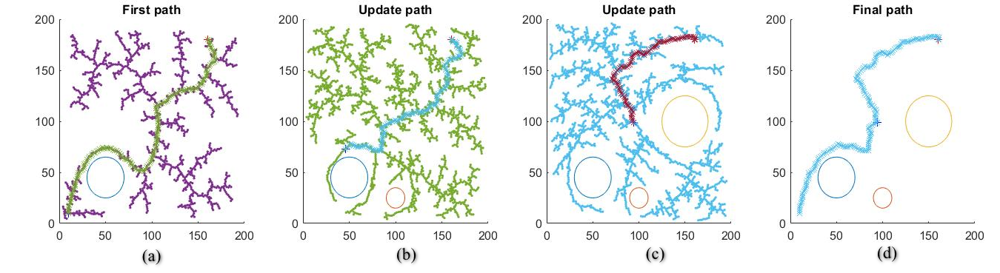

# Algorithm and Implementation

The implementation of the project has been done in MATLAB. Rapid-exploring Random Tree Algorithm has been implemented for trajectory plan and object detection algorithm has been built with depth information extracted from RealSense Camera. The overall implementation has been committed to GitHub at __[this link](https://github.com/luckymeng7/EECE597)__


```{r libraries, include=FALSE}
library(knitr)
library(dplyr)
library(lattice)

knitr::opts_chunk$set(echo = TRUE)
```

## Rapid-exploring Random Tree Algorithm for Pathway Planning 

Rapid-exploring Random Tree (RRT) algorithm was introduced by Steven M. LaVell and James J. Kuffner Jr [5].  To efficiently search nonconvex and high-dimensional spaces, the algorithm constructs a space-filling tree from samples drawn randomly in the search space and inherently grows towards large unsearched areas. 

The output of the RRT algorithm is a tree(T) that contains all of the randomly sampled nodes(q) with connection to their inherit points. With object-oriented programming, each of the sampled node has been assigned as a class of Node with properties of index, parent index, position and path to node. An RRT class is defined to contain all generated nodes, with properties of total number of the nodes, initial node, positions of all existing node and a list of all existing nodes. A new node will be sampled in each iteration and the RRT tree will be updated if the path to this new node has avoided the obstacle. To generate a new node(qnew), a random point(qrand) will be firstly generated within the map range. Then it will be connected to the nearest node(qnear) on the tree. On the connection line, a point with max-step distance (step size) to the nearest point will be selected as the new node if it is confirmed as clear with obstacle free function. Figure \@ref(fig:figure1) shows the generation of one new node to the tree. 


```{r figure1, echo=F, eval=T, fig.width=9, fig.asp=1.0, fig.cap='(ref:figure1)', out.width="60%", fig.align='center'}

```

(ref:figure1) New Node Generation

For a general configuration space, the algorithm in pseudocode is as follow [6]:

```
Algorithm T=(V,E) ← RRT*(qini)
T ← InitializeTree();
T ← InsertNode(𝜱, qini, T);

    for i = 1 to K do
        qrand ← RAND_CONF()
        qnearest ← NEAREST_VERTEX(qrand, T)
        qnew ← STEER (qnear, qrand, Δq)
	      if Obstaclefree(qnew) then
        	qnear ← Near(∆D, qnew, T);
		qmin ← Chooseparent(qnear, qnew, qnearest);
		T ← InsertNode(qmin, qnew, T);
		T ← Rewire(T,qmin, qnew, qnear);
      
    return T

```

* "←" denotes assignment. For instance, "largest ← item" means that the value of largest changes to the value of item.
*	"return" terminates the algorithm and outputs the following value.


The inputs for the algorithm are initial position, destination position, max step size, obstacle size and position and the overall map size. The output for the function is a planned path and the overall tree. 

Real-time obstacle detection has also been implemented. As the robot moving forward, the function would recalculate the tree when it detects a new obstacle shows up. The current position would be taken as the new start point and the destination position would still be the same. Figure \@ref(fig:figure2) shows path updated by twice after initial path planned.  

```{r figure2, echo=F, eval=T, fig.width=9, fig.asp=1.0, fig.cap='(ref:figure2)', out.width="70%", fig.align='center'}

```

(ref:figure2) Path updated when new obstacle detected

## Image Processing for Obstacle Detection

With the video stream captured with Intel RealSense camera, the depth information could be used for object detection. With MATLAB’s ROS toolbox, the bag video was imported and processed as depth frames and RGB frames. A function has been implemented to identify the obstacle based on the depth information. On each of the frames, a mask will be created as any pixels that has depth value within the sensitive detection range will be set to 100 and the rest pixels will be set to 0. The comparison between regular RGB image and detected obstacle area are shown in figure \@ref(fig:figure3)  

```{r figure3, echo=F, eval=T, fig.width=9, fig.asp=1.0, fig.cap='(ref:figure3)', out.width="80%", fig.align='center'}
knitr::include_graphics('figures/3.PNG')
```

(ref:figure3) Obstacle detected in depth field

In order to project the obstacles properly onto the map where the trajectory is planned, top views for each frame are created. By looping through the columns number of the depth image, using the smallest depth value of each column as the row number and assign row number of the related point to the value of that pixel for the top view. A distance threshold is used to set the limitation of the depth size. For example, currently, only objects within two meters distance would be captured as object and saved in top view as figure \@ref(fig:figure4). 

```{r figure4, echo=F, eval=T, fig.width=9, fig.asp=1.0, fig.cap='(ref:figure4)', out.width="30%", fig.align='center'}
knitr::include_graphics('figures/4.png')
```

(ref:figure4) Top view based on depth information

Output videos are created by combining frames of top views or obstacle masks on the RGB frames. 

## Measurement and Calculation of the Object Size 

Based on the datasheet of the RealSense camera [7], the horizontal field of view (FOV) for depth image is 74 degree and vertical field of view for depth image is 62 degree. Based on the definition of FOV in figure \@ref(fig:figure5) as follow: 


```{r figure5, echo=F, eval=T, fig.width=9, fig.asp=1.0, fig.cap='(ref:figure5)', out.width="60%", fig.align='center'}
knitr::include_graphics('figures/5.png')
```

(ref:figure5) Definition of field of view 

the actual width and height based on the pixel value could be calculated as:

$$ Actual width = \frac{width \space pixel}{resolution \space on \space width} \cdot depth \cdot \tan(\frac{74}{2}) \cdot 2 $$

$$ Actual height = \frac{height \space pixel}{resolution \space on \space width} \cdot depth \cdot \tan(\frac{74}{2}) \cdot 2 $$

In order to use actual size as base point to do the calibration, I transferred the above equations into:


$$ \tan(x) = \frac{rp \cdot L1}{l1 \cdot D1} $$

Where 
- rp is the resolution on width or height direction, 
- L1 is the actual width or height,
- l1 is the pixel number on width or height,
- D1 is the actual depth distance.

Another transfer for the equation would become:
$$\frac{L1}{l1 \cdot D1} = \frac{L2}{l2 \cdot D2} = C$$

The table \@ref(tab:mytable1) are the measurements that I used to calibrate the measurement with resolution 1280x720 for both depth image and RGB image. The measurement of actual height and width are done with a ruler on the object and the measurement of height and width in pixel is measured on the image directly. The depth value of the center point on the has been used as the depth info for the overall object. The unit for actual measurements is millimetre:


```{r mytable1, echo=F, eval=T}
df <- tribble(
  ~"Item Number", ~"Depth(mm)", ~"Height(Actual)", ~"Height(Pixel)", ~Ch, ~"Width(Actual)", ~"Width(Pixel)", ~Cw,
  #--/--/--/--/--/--/--/----
  1, 415,	75,	171, 0.00106,	225,	489,	0.00111,
  2, 297,	90,	270, 0.00112,	142,	435,	0.00109,
  3, 683, 252, 336, 0.00109, 173, 227.5, 0.00111
)

df <- as.data.frame(df)

 knitr::kable(t(df),
              booktabs = TRUE, escape=FALSE,
              caption = 'Measurements for calibration'
              )
```

Figure \@ref(fig:figure6) are the images for the above objects (1,2,3 from left to right):

```{r figure6, echo=F, eval=T, fig.width=9, fig.asp=1.0, fig.cap='(ref:figure6)', out.width="90%", fig.align='center'}
knitr::include_graphics('figures/6.PNG')
```

(ref:figure6) Definition of field of view 

To calculation with equation $$\frac{L1}{l1 \cdot D1} = \frac{L2}{l2 \cdot D2} = C$$, the following three objects in figure \@ref(fig:figure7) are measured (4, 5, 6 from left to right):

```{r figure7, echo=F, eval=T, fig.width=9, fig.asp=1.0, fig.cap='(ref:figure7)', out.width="90%", fig.align='center'}
knitr::include_graphics('figures/7.PNG')
```

(ref:figure7) Definition of field of view 

The comparison of calculation and measurement are as follow table \@ref(tab:mytable2) and table \@ref(tab:mytable3), where $$L1 = C \cdot l1 \cdot D1$$


```{r mytable2, echo=F, eval=T}
df <- tribble(
  ~"Item Number", ~"Depth(mm)", ~"Height(Pixel)", ~"Average Ch", ~"Width(Pixel)", ~"Average Cw",
  #--/--/--/--/--/----
  4, 2890, 670, 0.00109, 225, 0.0011,
  5, 325, 201, 0.00109, 152, 0.0011,
  6, 557, 518, 0.00109, 117, 0.0011
)

df <- as.data.frame(df)

 knitr::kable(t(df),
              booktabs = TRUE, escape=FALSE,
              caption = 'Information from image'
              )
```

```{r mytable3, echo=F, eval=T}
# df <- tribble(
#   ~"Item Number", ~"Calculated Height(mm)", ~"Actual Height(mm)", ~"Error Rate(%)", ~"Calculated Width(mm)", ~"Actual Width(mm)", ~"Error Rate(%)",
#   #--/--/--/--/--/--/----
#   4, 2110,	2100,	0.48,	898, 920,	2.4,
#   5, 71.2,	80,	11,	54.3,	60,	9.5,
#   6, 314.5,	325,	3.2,	71.7,	82,	12.6
# )

df <- tribble(
  ~"Item Number", ~"Calculated Height(mm)", ~"Actual Height(mm)", ~"Error Rate(percentage)", ~"Calculated Width(mm)", ~"Actual Width(mm)", ~"Weight Error Rate(percentage)",
  #--/--/--/--/--/--/----
  4, 2110,	2100,	0.48,	898, 920,	2.4,
  5, 71.2,	80,	11,	54.3,	60,	9.5,
  6, 314.5,	325,	3.2,	71.7,	82, 12.6
)


df <- as.data.frame(df)

 knitr::kable(t(df),
              booktabs = TRUE, escape=FALSE,
              caption = 'Measurement Result and Error Rate'
              )
```

According to the datasheet [7] of RealSense Camera, there is a mechanical tolerance of +/-5% for the camera. Therefore, the error measured is within the tolerance. As we could see, the error will be relatively smaller if the shape of the object is rectangle and facing the camera perpendicularly.  Physical measurement on object with anomalous shape will introduce more error compare to rectangles. Also, to simplify the calculation, depth value of the center on the object was taken to calculate the constant C and later the actual height or width. However, the depth value at the center of the water bottle is different from the depth value for the edge. This deviation on depth value will introduce more error. Objects not facing the camera perpendicularly will also introduce errors with the misalignment for the width and height.

To increase the accuracy for the measurement, two optimization strategies could be done. First one is using the average depth value of the object for the calculation. The other method is to calculate the width or height with the coordination in 3D which combines both depth and RGB information.   
 
## Combination of Obstacle Detection and Trajectory Plan

In order to integrate the detected obstacle onto the trajectory plan, the detected obstacle top view will be projected on the map canvas after re-size and rotation. Assuming the camera is facing the destination direction when it is at initial point and the overall canvas has a dimension of 200x200 pixel, the top view obstacle will be re-sized to meet the mapping scale and rotated to the camera orientation. A mask based on the top view frames will be shifted to the start point with the bottom center point coincide with the camera’s current position, which is the initial position for now. As there is a new obstacle detected, the trajectory plan function will re-calculate the RRT tree. Figure \@ref(fig:figure8) shows the obstacle mask generated with the top view frame from section 3.2 and the RRT calculated with obstacle mask projected on map canvas. The scale for the map canvas is 1:31.25, which means that 31.25 pixels on the map represent 1 meter. 

```{r figure8, echo=F, eval=T, fig.width=9, fig.asp=1.0, fig.cap='(ref:figure8)', out.width="90%", fig.align='center'}
knitr::include_graphics('figures/8.png')
```

(ref:figure8) Definition of field of view

Later, once the camera starts to move based on the generated path, the object detection and projection will continue. After the initial position, the direction of the camera will be defined by the vector subtraction from current coordinate by previous coordinate. And the mask will be re-size based on the scale, then rotated to the current direction and shifted to the current position. If more obstacles are found since last project, the RRT tree will be recalculated. 
In order to increase the safety and avoid the drone being trapped in the anomaly shaped obstacle, a minimum volume ellipsoid has been generated to cover all of the obstacle points as shown in figure \@ref(fig:figure9). The algorithm to find the ellipsoid is discussed in the textbook “Convex Optimization” [9] and the function usage in MATLAB is described in [10]. 

```{r figure9, echo=F, eval=T, fig.width=9, fig.asp=1.0, fig.cap='(ref:figure9)', out.width="90%", fig.align='center'}

```
(ref:figure9) Detected obstacle with minimum volume ellipsoid covered

Because of the long RRT calculation time and video processing time, the object will be checked every 5s when the robot’s moving speed is 0.1m/s

## Update the path as obstacle moving
Several scenarios have been demonstrated to prove that the implementation could recalculate the path if the camera detect the object change. Multiple obstacles would show up in the global map as the robot moving along the path. Also, the original obstacles would change the position from time to time. The program would recalculate the RRT tree when changes happen to the environment. 

Ideally, the path would only be recalculated when new obstacles are added in the map as shown in figure 2. However, in reality, with the vibration and inaccuracy from the camera, the detected obstacle would change all the time. If the function is set to recalculate the RRT whenever detecting the change in obstacle, it would keep recalculating. Therefore, in the implementation, an update rate has been defined to set the time between the updates of the camera streaming.  

The following are two demos on the path updated when new objects detected in figure \@ref(fig:figure10) and path updated when object is changed position in figure \@ref(fig:figure11). 

```{r figure10, echo=F, eval=T, fig.width=9, fig.asp=1.0, fig.cap='(ref:figure10)', out.width="90%", fig.align='center'}

```
(ref:figure10) Path updated when new objects detected


```{r figure11, echo=F, eval=T, fig.width=9, fig.asp=1.0, fig.cap='(ref:figure11)', out.width="90%", fig.align='center'}
knitr::include_graphics('figures/11.png')
```
(ref:figure11) Path updated when object moved

The update for the input of obstacles are done by streaming the video separately at different time point. Then feeding these videos are fed into the system which would recalculate the path. This process proves the concept of the capability on updating the obstacles in real time. An actual real time object detection during path planning could be implemented with RealSense SDK in the future. 
