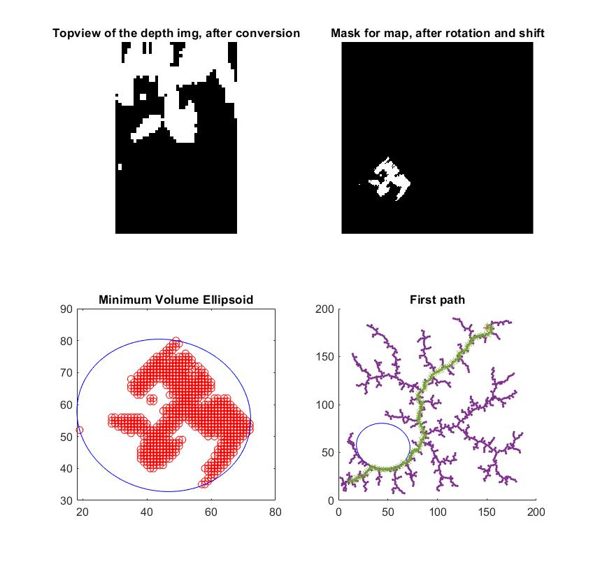
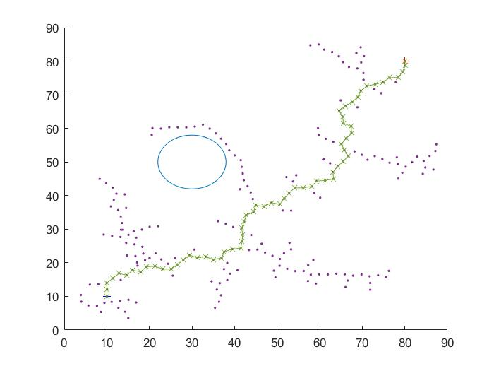
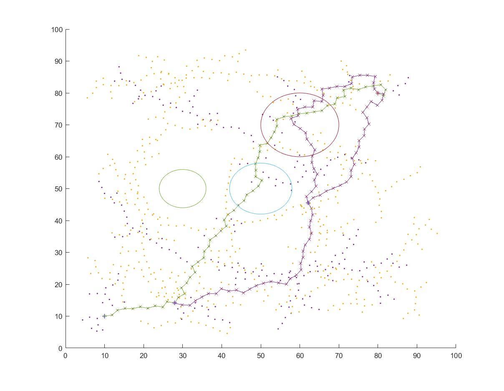
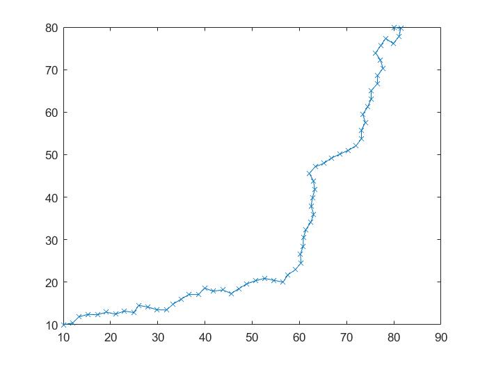
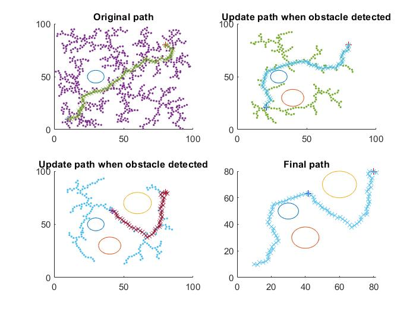
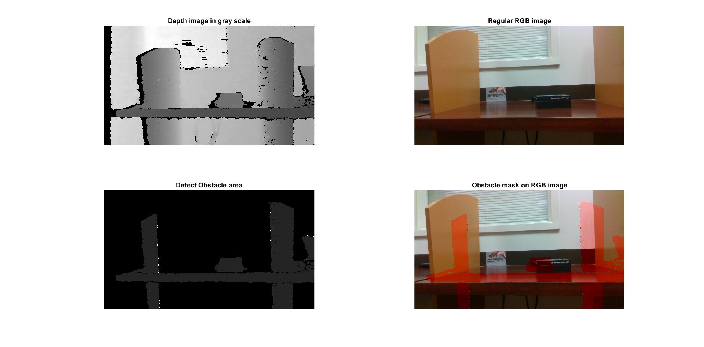
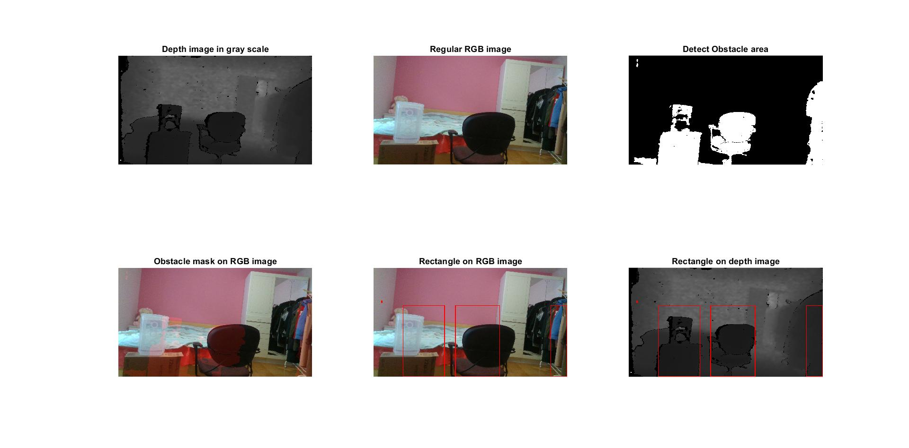
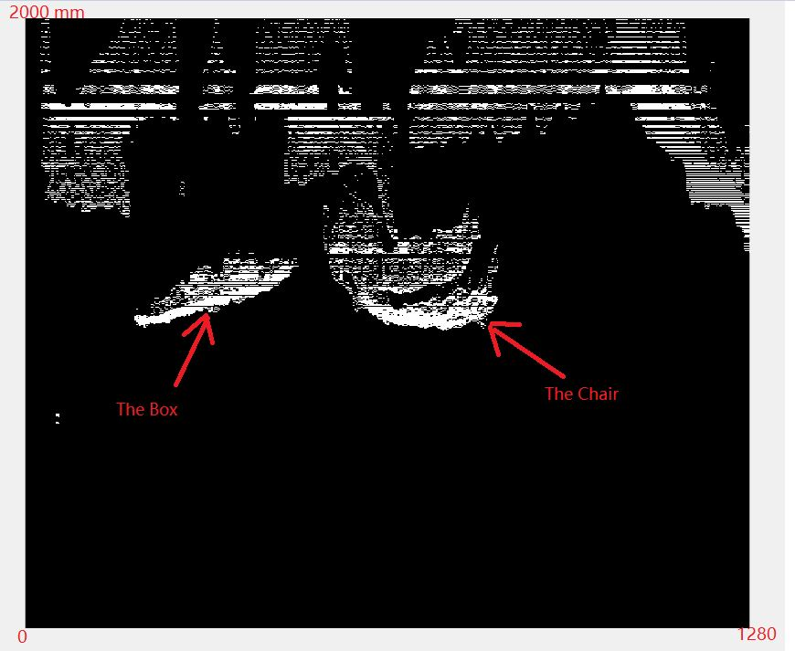
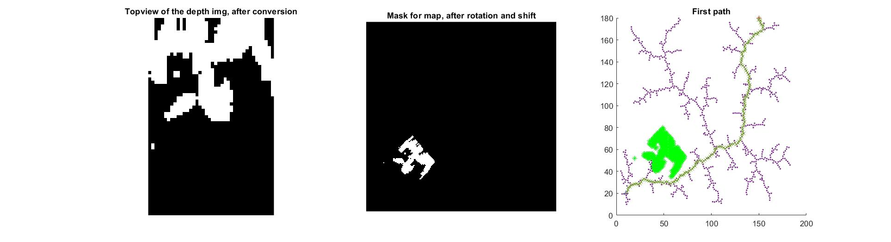

# Trajectory planning with real time vision-based obstacle detection
This project implemented object detected with RealSense camera with RRT trajectory plan algorithm, simulated in MATLAB environment. This project is done during UBC project course EECE597. Thanks for the supervision of Dr. Maryam Kamgarpour and Dr. Mahdi Yousefi. 

## Introduction to the repo
There are three main parts for this project: trajectory plan algorithm, obstacle dection with RGBD image processing, and integration of the detected obstacle to trajectory plan. 

The final report is [here](https://luckymeng7.github.io/EECE597/FinalReport/thesis.pdf).

Further instruction on UBC report template is [here](https://luckymeng7.github.io/EECE597/FinalReport/).

## Usage instruction
#### Packages need to be installed in MATLAB (Please contact me if other toolboxes needed):
- ROS Toolbox

#### To run the integrated result:
- Clone the whole repo to local 
- Nevigate to folder integrate and open one of the matlab scripts here
- Type this command in command window: __run("integrate_main.m")__
- Add any path needed to be included

## Progress logs 

### 1. Path planning with RRT, MATLAB (Feb 26, 2020)

### 2. Real-time path planning with RRT, add obstacle half way (March 4, 2020)

__Acutal path__

__Another Example__

### 3. Object Detection (March 11, 2020)

### 4. Improvement on Object Detection (March 25, 2020)

#### Top View image from depth info

### 5. Map the obstacle on path plan (Apr 1, 2020)

### 6. Map the obstacle with an ellipse boundary (Apr 9, 2020)

