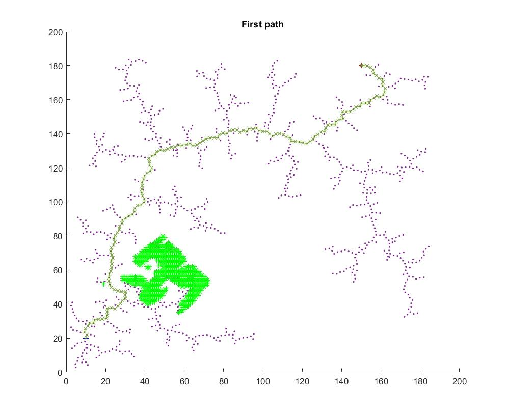

# EECE597
EECE 597 Project code will be commit here

## 1. Path planning with RRT, MATLAB (Feb 26, 2020)

## 2. Real-time path planning with RRT, add obstacle half way (March 4, 2020)

__Acutal path__

## 3. Object Detection (March 11, 2020)

## 4. Improvement on Object Detection (March 25, 2020)

>Obstacle 1 width: 33 mm, Obstacle 1 height: 76 mm
>
>Obstacle 2 width: 918 mm, Obstacle 2 height: 1504 mm
>
>Obstacle 3 width: 819 mm, Obstacle 3 height: 1255 mm
>
>Obstacle 4 width: 417 mm, Obstacle 4 height: 1758 mm

### Top View image from depth info

## 5. Map the obstacle on path plan (Apr 1, 2020)

